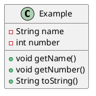

<!-- 设置格式开始 -->

<!-- 设置格式结束，正文开始 -->

# 关于搭客
## 什么是搭客
搭客（“Docker”的中文译名）是一个用于开发、发布和运行应用程序的开放平台。它能让你把应用程序从基础设施的复杂中解放出来，从而进行快速交付。在搭客里，可以像管理应用程序一样来管理基础设施。利用搭客可以快速交付、测试、部署的优点，你可以显著缩短代码开发到生产环境运行的周期。

## 为什么使用搭客
使用搭客容器，可以使得应用程序在各种不同的系统环境中，具有统一的运行环境。

# 体系结构
搭客使用”客户端-服务器“模式（CS模式）的架构。守护进程负责构建、运行和分发搭客容器等繁重工作。客户端通过标准表述状态转移接口（”RESTful API“的中文译名）与守护进程进行对话。客户端和守护程序可以不在同一系统上运行，能够连接到远程的搭客守护程序。

## 守护进程
搭客守护进程 (dockerd) 监听来自搭客接口（Docker API）的命令，并管理镜像、容器、网络和卷等搭客的对象。此外，守护进程还可以与其他守护进程通信以管理搭客的服务。

## 客户端
搭客客户端（docker）是许多搭客用户与搭客交互的主要方式。例如，当你使用 ”docker run“等命令时，客户端会将这些命令通过搭客接口发送给守护进程，然后守护进程会执行这些命令。搭客客户端可以与多个守护进程通信。

## 注册表
搭客注册表（registries）用于存储搭客映像。搭客注册中心（Docker Hub）是一个任何人都可以使用的公共注册表，并且搭客的默认配置就是在搭客注册中心上查找镜像。此外，运行私有的注册表也是被允许的。

当使用”docker pull“或”docker run“命令时，将从配置的注册表中提取所需的镜像。当使用”docker push“命令时，构建的镜像会被推送到配置的注册表中。

## 对象
使用搭客时会创建和使用图像、容器、网络、卷、插件等对象。下面列举几种常用对象进行说明。

### 镜像
镜像是一个用于创建搭客容器的只读模板。通常，一个镜像是基于另一个镜像构建的，并且带有一些额外的自定义配置。您可以创建、使用自己的镜像，也可以使用其他人在注册表中发布的镜像。

### 容器
容器是镜像的运行实例。通过搭客客户端可以创建、启动、停止、移动或删除容器。 可以将容器连接到一个或多个网络，也可以为它附加存储，甚至还可以根据其当前状态创建新的镜像。

在默认情况下，一个容器与其他容器及其宿主机的隔离相对较高。 可以通过控制容器的网络、存储或其他底层子系统来调整隔离程度。

容器是由其镜像和创建或启动时指定的配置共同定义。当容器被移除时，任何没有保存在持久化存储中的修改都会消失。

https://www.docker.com/

https://www.runoob.com/docker/docker-hello-world.html